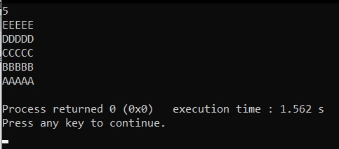
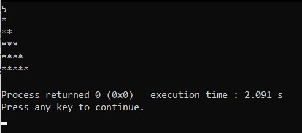
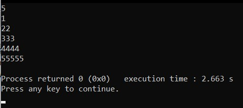
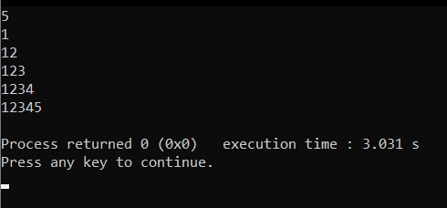
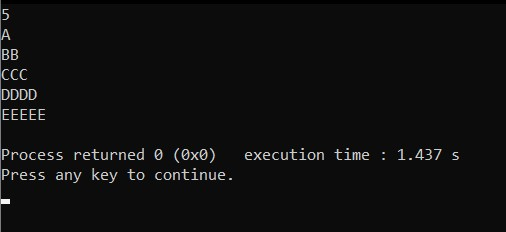
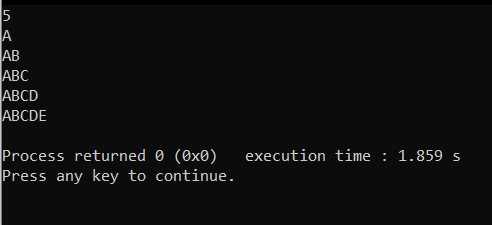
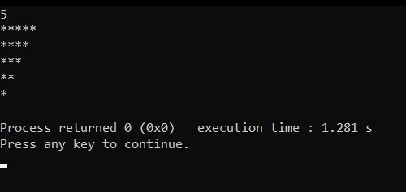
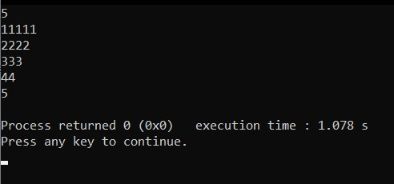
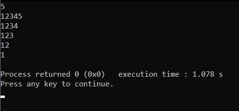

# Patterns in C++ Language :smile: :

Pattern 1

Pattern 2

Pattern 3

Pattern 4

Pattern 5

Pattern 6

Pattern 7

Pattern 8

Pattern 9

Pattern 10

Pattern 11

Pattern 12

Pattern 13

Pattern 14

Pattern 15

Pattern 16

Pattern 17

