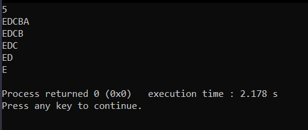

# Patterns in C++ Language :smile: :

Pattern 1

Pattern 2

Pattern 3

Pattern 4

Pattern 5

Pattern 6

Pattern 7

Pattern 8

Pattern 9

Pattern 10

Pattern 11

Pattern 12

Pattern 13

Pattern 14

Pattern 15

Pattern 16

Pattern 17

Pattern 18

Pattern 19

Pattern 20

Pattern 21

Pattern 22

Pattern 23

Pattern 24

Pattern 25

Pattern 26

Pattern 27

Pattern 28

Pattern 29

Pattern 30

Pattern 31

